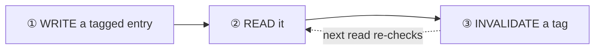
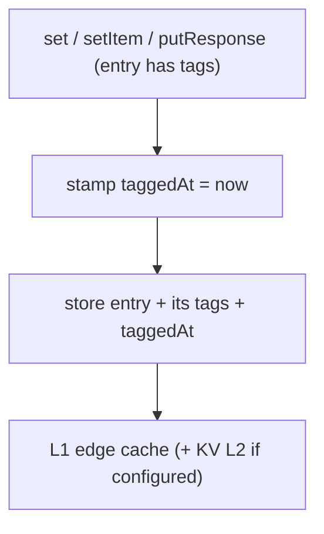
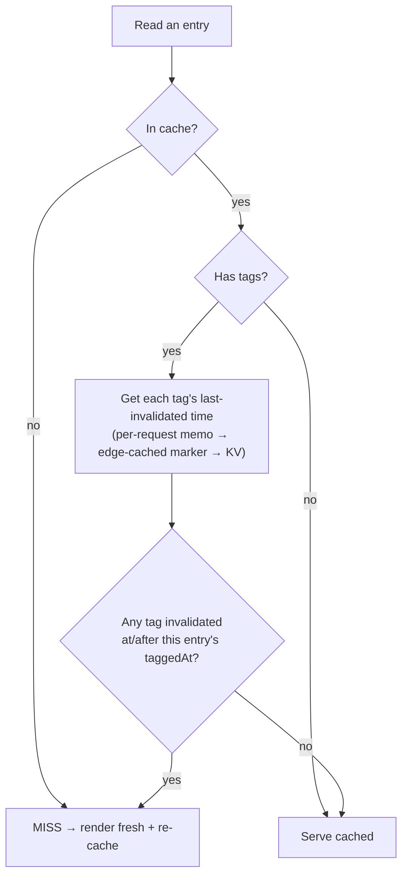
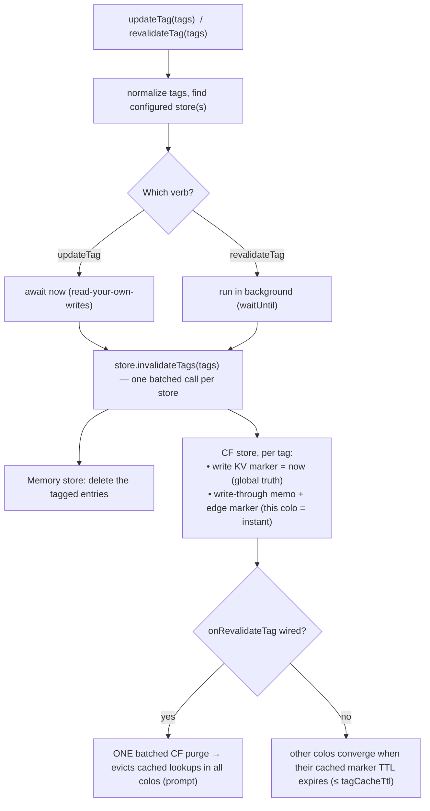

# Cache Tag Invalidation — Flow (for review)

A visual walkthrough of how `cacheTag` / `cache({ tags })` + `updateTag` /
`revalidateTag` work, for human review. The whole system reduces to **one rule**:

> An entry is served only if **none** of its tags was invalidated at or after the
> entry's own `taggedAt` timestamp.

Nothing is hunted down and deleted in the Cloudflare case — invalidation records a
timestamp, and reads compare against it. That is why an entry written _after_ an
invalidation stays fresh automatically.

Source: `packages/rangojs-router/src/cache/cache-tag.ts`,
`cache/tag-invalidation.ts`, `cache/memory-segment-store.ts`,
`cache/cf/cf-cache-store.ts`. Consumer guide: `skills/caching` ("Tag-Based
Invalidation").

---

## Overview



The three verbs a consumer touches:

| API                      | Where                           | Semantics                                                          |
| ------------------------ | ------------------------------- | ------------------------------------------------------------------ |
| `cacheTag(...tags)`      | inside a `"use cache"` function | tag the entry at runtime                                           |
| `cache({ tags })`        | route DSL                       | tag the entry (static array or `(ctx) => string[]`)                |
| `updateTag(...tags)`     | server actions                  | **read-your-own-writes** — awaitable, immediate                    |
| `revalidateTag(...tags)` | route handlers / webhooks       | background (non-blocking) — hard-purge, next read re-renders fresh |

`cacheTag(...tags)` has a second, render-callable form: called during a request
render **outside** any `"use cache"` function, it records onto the request's
`_requestTags` instead of throwing. PPR shell capture and the document cache union
that set onto their entry, so a plain server component can tag the shell/full-page
artifact it renders into — `revalidateTag` then evicts it. On a route that is
neither PPR nor document-cached the tag records where nothing reads it (a no-op).

---

## ① WRITE — caching a tagged entry



The entry carries its tags and the moment it was cached (`taggedAt`). That
timestamp is the only thing reads need to make the freshness decision.

---

## ② READ — the freshness decision



- Untagged entries pay nothing — the tag check is skipped entirely.
- For tagged entries, the per-tag "last-invalidated time" (the **marker**) is
  resolved through a cascade so a hot route does not hit KV on every read:
  - **per-request memo** — one lookup per distinct tag per request;
  - **edge-cached marker** — only when `tagCacheTtl > 0`; serves the marker from
    the per-colo Cache API within that window;
  - **KV** — the global source of truth (memory store has no KV step; it deletes
    eagerly, so its reads do no tag work at all).

---

## ③ INVALIDATE — `updateTag` / `revalidateTag`



- The whole tag batch from one call is handed to each store at once, so the
  Cloudflare store fires `onRevalidateTag` **once** (one CDN purge request, which
  respects purge-by-tag rate limits) rather than once per tag.
- The colo that runs the invalidation is correct **immediately** (KV marker +
  write-through). Other colos either converge within `tagCacheTtl`, or — if a
  purge is wired — are evicted promptly by the batched purge.

---

## Why single-store (no companion tag store)

Memory and Cloudflare invalidate _oppositely_, both within their one store:

- **`MemorySegmentCacheStore`** is one process → `invalidateTags` **deletes** the
  tagged entries immediately. Reads do no tag work.
- **`CFCacheStore`** is per-colo and cannot be purged cross-colo eagerly → it
  records a **marker** (timestamp) in its _own_ KV namespace and reads compare
  against it. There is no separate tag-invalidation store to configure.

## Config knobs (CFCacheStore)

| Option               | Default          | Role                                                                                                             |
| -------------------- | ---------------- | ---------------------------------------------------------------------------------------------------------------- |
| `kv`                 | —                | required for distributed invalidation; markers live here                                                         |
| `tagCacheTtl`        | `0` (off)        | edge-cache the markers for N s to cut KV reads; max extra cross-colo invalidation latency when no purge is wired |
| `tagInvalidationTtl` | none (no expiry) | how long a KV marker lives; must **exceed** max entry TTL+SWR                                                    |
| `onRevalidateTag`    | —                | batched purge hook; receives the namespaced `Cache-Tag`s to purge so cached lookups are evicted in every colo    |

`tagCacheTtl` (small, a staleness ceiling) and `tagInvalidationTtl` (large, must
outlive data) size oppositely — see their JSDoc.

## Marker Cache-Tags (only when `tagCacheTtl > 0`)

Each edge-cached marker carries three namespaced tiers so a purge can target it:

```
rg:{ns}             # everything this store cached (deploy / nuclear reset)
rg:{ns}:lk          # all tag lookups
rg:{ns}:lk:{tag}    # this tag's lookup — the normal updateTag purge target
```

`{tag}` is `encodeURIComponent`'d, so commas/spaces can't corrupt the
comma-delimited `Cache-Tag` header. `onRevalidateTag` is handed the
`rg:{ns}:lk:{tag}` values to feed Cloudflare's purge-by-tag API.

> The purge API call cannot be exercised in miniflare; it is unit-tested with a
> mock purge client and needs deployed-worker verification.

## Tag-marker read latency, and why there is no in-isolate marker cache

The marker check is on the **serial path of every tagged hit**: a tagged read is
`match → await marker → await body` (`cf-cache-store.ts`, `get`/`getItem`). A
degraded namespace can pin the marker read up to `kvReadTimeoutMs` (default
170 ms) before it **fails open** — treats the marker as absent so the entry is
served — so one slow tag never turns a hit into a wrongful invalidation.

Measured on a real Cloudflare zone (`debug: true`, `tagCacheTtl: 0`, i.e. the
least-cached cascade memo → KV):

| condition                                             | `markerMs`           |
| ----------------------------------------------------- | -------------------- |
| warm — KV's per-colo edge cache serving the marker    | 1–6 ms (median ~2–3) |
| cold — genuine first touch, KV marker edge-cache cold | ~73 ms (n=1)         |

The cold blip is rare and sticky-warm — an 80 s idle did not re-cool it (KV's
per-colo edge cache outlives a minute).

**Rejected: an in-isolate module-level marker `Map`** (an L0 in front of the
cascade). It only speeds _warm-isolate repeats_, which are already the 1–6 ms
reads, and is cold exactly when reads are slow — a cold isolate starts with a
cold Map and still pays the full first read. `tagCacheTtl` (the per-colo Cache
API tier already in the cascade) is strictly better for that case: colo-shared
and surviving isolate churn, so one warm-up shields every isolate in the colo,
and during a transient KV slowdown at most ~1 KV read per `tagCacheTtl` window
per colo is exposed instead of one per request. The in-isolate layer is also not
cheap to get right — binding-keyed module state, write-through from
`invalidateTags`, a no-downgrade-on-settle guard, bounded eviction — correctness
work for a sub-3 ms warm-path win it mostly cannot deliver.

**If marker latency ever needs to drop further**, in order: (1) enable
`tagCacheTtl` (1–5 s) and re-measure `markerMs` _and_ `bodyReadMs` under
`debug: true` — the lever for the cold/slow tail; (2) only past that, parallelize
`marker ∥ body` so the hit path is `match + max(marker, body)` instead of
`match + marker + body` — worth the critical-path churn only if `bodyReadMs` on
tagged hits is large enough to be worth overlapping. The in-isolate Map is not on
this list.
