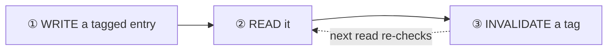
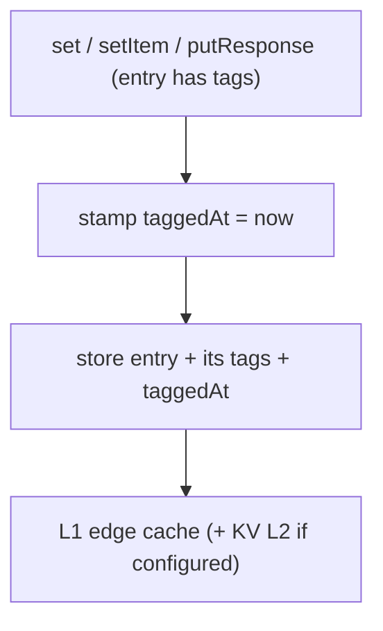
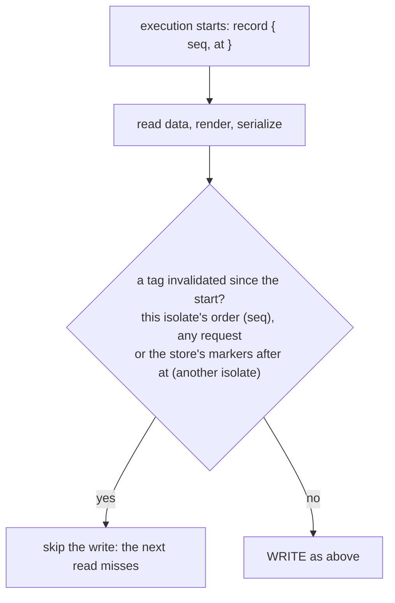
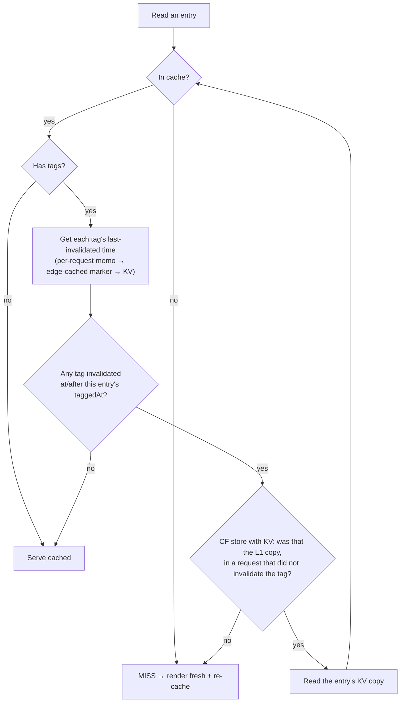
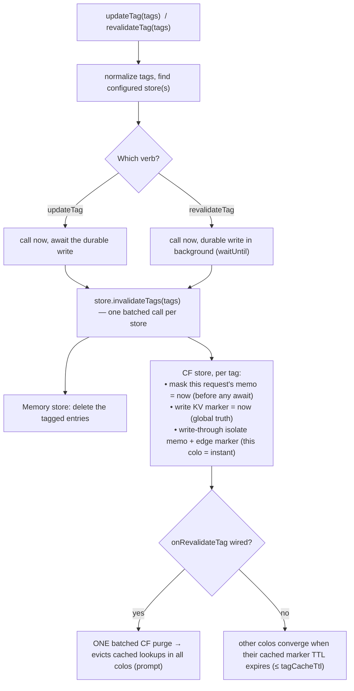

# Cache Tag Invalidation — Flow (for review)

A visual walkthrough of how `cacheTag` / `cache({ tags })` + `updateTag` /
`revalidateTag` work, for human review. The whole system reduces to **one rule**:

> An entry is served only if **none** of its tags was invalidated at or after the
> entry's own `taggedAt` timestamp.

Nothing is hunted down and deleted in the Cloudflare case — invalidation records a
timestamp, and reads compare against it. That is why an entry written _after_ an
invalidation stays fresh automatically.

Source: `packages/rangojs-router/src/cache/cache-tag.ts`,
`cache/tag-invalidation.ts`, `cache/memory-segment-store.ts`,
`cache/cf/cf-cache-store.ts`. Consumer guide: `skills/caching` ("Tag-Based
Invalidation").

---

## Overview


```mermaid
flowchart LR
  W["① WRITE a tagged entry"] --> R["② READ it"] --> I["③ INVALIDATE a tag"]
  I -. "next read re-checks" .-> R
```

The three verbs a consumer touches:

| API                      | Where                           | Semantics                                                                                                    |
| ------------------------ | ------------------------------- | ------------------------------------------------------------------------------------------------------------ |
| `cacheTag(...tags)`      | inside a `"use cache"` function | tag the entry at runtime                                                                                     |
| `cache({ tags })`        | route DSL                       | tag the entry (static array or `(ctx) => string[]`)                                                          |
| `updateTag(...tags)`     | server actions                  | **read-your-own-writes** — awaitable, immediate                                                              |
| `revalidateTag(...tags)` | route handlers / webhooks       | background (non-blocking) — hard-purge, next read re-renders fresh; the calling request reads its own writes |

`cacheTag(...tags)` has a second, render-callable form: called during a request
render **outside** any `"use cache"` function, it records onto the request's
`_requestTags` instead of throwing. The document cache unions that set onto its
entry. A PPR shell takes the tags of its doc record instead (the segment record
its handler layer renders into, written like a route `cache()` record below),
plus its bake-lane loaders' and `ppr.tags`. Either way a plain server component
can tag the shell/full-page artifact it renders into — `revalidateTag` then
evicts it. On a route that is
neither PPR nor document-cached and has no `cache()`, the tag records where
nothing reads it (a no-op).

Inside a route `cache()` boundary the same tags also land on that route's
`cache()` record (#957). A HIT does not run the covered handlers or re-render
their server components, so the record stores the tags its content recorded
when it was written — render-callable `cacheTag()` calls and the tags of
`"use cache"` reads, from handlers and server components alike — and a HIT
records them onto `_requestTags` and onto the replayed segments again
(`recordSegmentTags`). Two consequences:

- A PPR shell captured by replaying the record, or a document stored over a
  record HIT, still carries those tags, so `updateTag()` evicts it.
- The record itself is invalidated by them, so after `updateTag()` the next
  render re-runs the covered handlers instead of replaying pre-update output
  until ttl+swr.

A HIT replays all covered handler output and handle values, `loading()`
subtrees included, so every tag that output recorded goes on the record. A
loader's tags reach the record only when a handler consumes its value
(`ctx.use()`), whoever started the loader. A loader nobody reads on the server,
such as one read by `useLoader()` under `loading()`, runs per request and stays
off the record. The attribution lives in `src/cache/cache-tag.ts`
(`runInSegmentTagScope`, `linkLoaderTags`, `recordLoaderTags`) and
`CacheScope.cacheRoute` (`collectRecordTags`). It runs only for a request whose
match resolved a cache scope (`armRecordTagOwners`).

A loader with its own `cache()` (`loader(Def, () => [cache({...})])`) has the
same problem one level down (#964): a HIT does not run the loader body, so the
tags the body recorded are missing from that request. The loader entry
therefore stores them next to its `cache({ tags })`, and they invalidate it:

- **What is stored.** Every tag the execution recorded: `cacheTag()` in the
  body, `"use cache"` reads, render-time tags of server components in the value
  or a handle push, and the tags of every loader value the body read with
  `ctx.use()`, whoever ran that loader. You might expect "whoever ran it" to be
  the hard part: the cached body starts only after `getItem` misses, so by then
  the route's and layouts' other loaders, and anything the handler read, are
  already running. The mechanism is built around that:
  - Every loader execution records into its own set, held on its loader body
    scope (`runInsideLoaderBodyScope` in `src/server/context.ts`, from
    `createLoaderExecutor` in `src/router/loader-resolution.ts`). The miss
    opens one more set around its execution and the two Flight encodes
    (`captureRecordedTags` in `src/cache/cache-tag.ts`). Whichever was entered
    last receives the tags.
  - Every read of a loader's value links the reader's set to that value's set
    (`readValueTags`): a memo hit, a fresh start, or the value of a loader
    with its own `cache()`. The latter carries its `cache({ tags })` plus its
    entry's tags on a HIT, or its execution's on a MISS.
  - The write flattens the links (`flattenRecordedTags`) after its value
    settled, so the order of the reads does not matter for the tags the
    executions record.
  - A binding's `cache({ tags })` are not recorded by any execution, so they
    are attached explicitly: at kickoff the binding links an execution a
    reader already started to them (`_bindLoaderCacheTags` in
    `setupLoaderAccess`), and every later execution outside the binding
    (a stale refresh's included) links itself. The one case this misses: a
    cached reader that started the loader before its binding, and flattened
    its own write before the binding started (a cached layout loader reading
    a route's cached loader). That entry has the loader's body tags but not
    its config-only tags. It needs all three of: a reader that starts a cached
    loader before its binding, a cached loader downstream, and config tags the
    body does not also record with `cacheTag()`.
  - A reader that started a loader before its binding keeps the value of its
    own run; one value per request holds from the binding's start on (as on
    main).
  - The sets and links cost a Set and a WeakMap entry per loader execution,
    so they run only for a request that can read them: the match arms them
    when a matched entry, parallel slot, orphan layout or intercept binds a
    loader with its own `cache()` (`bindsLoaderCache` in `loader-cache.ts`,
    `armLoaderTagSets`), before any loader starts; the binding's funnel arms
    them too, for a render the match did not see. Everywhere else a loader
    execution allocates nothing extra, the same rule #957's owners follow.
- **One value per loader per request.** A loader body's `ctx.use()` of a
  loader with its own `cache()` resolves to that binding's value, as a handler
  read does (`useLoader` checks `_loaderCacheOverrides`). Before #964 it went
  to the executor memo, which a HIT never fills, so the bound loader ran again
  and the reader saw a different value from the page.
- **What a HIT does.** It records the stored tags through the loader's owner
  (`recordLoaderTags`), so they reach `_requestTags` (document, PPR shell) and
  — through `linkLoaderTags` — any route `cache()` record whose handler reads
  the loader. `updateTag()` of a body tag then drops the loader entry, the
  record and the shell together; dropping only the record would re-serve the
  same stale loader value.
- **Stale-while-revalidate.** The background refresh runs its own capture on
  its own loader executor (`_runLoaderIsolated`), so every execution in it gets
  a new set, and the refreshed entry stores the refreshed body's tags. The
  stale entry's tags, re-recorded by the foreground HIT outside any set, never
  leak into it. The refresh also does not see the page's bindings
  (`_loaderCacheOverrides` is shadowed on its ctx): a loader it reads runs
  again, fresh, and links the binding's `cache({ tags })`. Reading the page's
  binding instead would rebuild the entry from the other loader's stale value
  whenever both went stale together, leaving it one generation behind on every
  SWR cycle. This is also why the owner graph from #957 (`l:<loaderId>`) is
  not the source: it holds the stale HIT's re-recorded tags, and it only runs
  in requests that can write a route record.

All three stores already carry item tags through `setItem`/`getItem`
(`MemorySegmentCacheStore`, `CFCacheStore` L1 headers and the KV envelope's
`t`, `VercelCacheStore`'s envelope `t`), so the change is store-agnostic. An
entry written before #964 carries only its `cache({ tags })` until it expires
or is rewritten.

---

## ① WRITE — caching a tagged entry


```mermaid
flowchart TD
  A["set / setItem / putResponse (entry has tags)"] --> B["stamp taggedAt = now"]
  B --> C["store entry + its tags + taggedAt"]
  C --> D["L1 edge cache (+ KV L2 if configured)"]
```

The entry carries its tags and the moment it was cached (`taggedAt`). That
timestamp is the only thing reads need to make the freshness decision.

Which is why a write must not carry data older than its stamp
([#977](https://github.com/rangojs/rango/issues/977)). An execution that
read its data before `updateTag("x")` and finished after it would be stamped
after the invalidation and served as fresh. So before the store write, every
writer asks `predatesInvalidation(store, tags, start)` (`tag-invalidation.ts`)
and skips the write when one of the entry's tags was invalidated after the
execution started:


```mermaid
flowchart TD
  S["execution starts: record { seq, at }"] --> R["read data, render, serialize"]
  R --> Q{"a tag invalidated since the start?<br/>this isolate's order (seq), any request<br/>or the store's markers after at (another isolate)"}
  Q -- yes --> K["skip the write: the next read misses"]
  Q -- no --> W["WRITE as above"]
```

The execution still returns what it read. A skipped write only costs a later
miss, never a stale read. `caching.md` "The write gate" has the writers, the
store answers and what stays open.

An entry's tags are everything its content recorded: a `"use cache"` entry
also carries the tags of the `"use cache"` functions it calls, from their
miss or their stored entry
([#980](https://github.com/rangojs/rango/issues/980)), as a route `cache()`
record and a loader's own `cache()` do for the reads inside them.

---

## ② READ — the freshness decision


```mermaid
flowchart TD
  A["Read an entry"] --> B{In cache?}
  B -- no --> MISS["MISS → render fresh + re-cache"]
  B -- yes --> C{Has tags?}
  C -- no --> SERVE["Serve cached"]
  C -- yes --> D["Get each tag's last-invalidated time<br/>(per-request memo → edge-cached marker → KV)"]
  D --> E{"Any tag invalidated<br/>at/after this entry's taggedAt?"}
  E -- yes --> F{"CF store with KV: was that the L1 copy,<br/>in a request that did not invalidate the tag?"}
  F -- yes --> G["Read the entry's KV copy"] --> B
  F -- no --> MISS
  E -- no --> SERVE
```

- Untagged entries pay nothing — the tag check is skipped entirely.
- On `CFCacheStore` with KV the check runs per tier. An L1 (Cache API) copy
  that fails it is not the end of the read: the store reads the entry's KV
  copy and runs the same check on it, so a colo serves (and promotes) an entry
  another colo re-rendered, or a `router.prerender()` warm wrote, after the
  invalidation instead of rendering it again. A KV copy that fails the check
  is the MISS: usually the twin written with the L1 copy, or the old value KV
  still returns before a newer write has spread. The request that ran
  `updateTag()` / `revalidateTag()` skips the KV read: it re-renders what it
  invalidated. Details: [caching.md](./caching.md) "Implementations".
- For tagged entries, the per-tag "last-invalidated time" (the **marker**) is
  resolved through a cascade so a hot route does not hit KV on every read:
  - **per-request memo** — one lookup per distinct tag per request;
  - **edge-cached marker** — only when `tagCacheTtl > 0`; serves the marker from
    the per-colo Cache API within that window;
  - **KV** — the global source of truth (memory store has no KV step; it deletes
    eagerly, so its reads do no tag work at all).
- In **purge mode** (`tagPurge` configured) an ordinary L1 data hit consults
  only the per-request memo — eviction is the purge's job; see "Purge mode"
  below. KV reads always run the full cascade; PPR shell reads do too while KV
  is bound, with a per-isolate stale-while-revalidate marker memo in front of
  it (`memo.markerFreshMs` / `markerMaxStaleMs`; shell reads only, see
  "Tag-marker read latency" below). KV-less, shells adopt the purge-trust read
  like the data families.

---

## ③ INVALIDATE — `updateTag` / `revalidateTag`


```mermaid
flowchart TD
  A["updateTag(tags)  /  revalidateTag(tags)"] --> B["normalize tags, find configured store(s)"]
  B --> C{Which verb?}
  C -- "updateTag" --> D["call now, await the durable write"]
  C -- "revalidateTag" --> E["call now, durable write in background (waitUntil)"]
  D --> F["store.invalidateTags(tags) — one batched call per store"]
  E --> F
  F --> G["Memory store: delete the tagged entries"]
  F --> H["CF store, per tag:<br/>• mask this request's memo = now (before any await)<br/>• write KV marker = now (global truth)<br/>• write-through isolate memo + edge marker (this colo = instant)"]
  H --> J{onRevalidateTag wired?}
  J -- yes --> K["ONE batched CF purge → evicts cached lookups in all colos (prompt)"]
  J -- no --> L["other colos converge when their cached marker TTL expires (≤ tagCacheTtl)"]
```

- The whole tag batch from one call is handed to each store at once, so the
  Cloudflare store fires `onRevalidateTag` **once** (one CDN purge request, which
  respects purge-by-tag rate limits) rather than once per tag.
- Both verbs call `invalidateTags()` synchronously, and each store masks the
  tags for the rest of the calling request before its first await (#973). So
  a server action that runs `revalidateTag("x")` and then renders reads past
  every entry tagged `x` stored before the call, although the KV put has not
  landed. The mask only turns that request's hits into misses: if the put
  then fails, the request paid extra misses and other requests read KV as it
  is (a marker read in flight when the mask is set publishes nothing to L1
  or the isolate memo). Details and the per-store table:
  [caching.md](./caching.md) "Read-your-own-writes in the invalidating
  request".
- Both verbs also record the tags in the isolate's invalidation order, for
  every request. Work any request started before the call (a `"use cache"`
  execution or refresh, a loader's own `cache()`, a route `cache()` render, a
  document-cache render) does not write its value after it: see "① WRITE".
- The colo that runs the invalidation is correct **immediately** (KV marker +
  write-through). Other colos either converge within `tagCacheTtl`, or — if a
  purge is wired — are evicted promptly by the batched purge.
- With `tagPurge` configured (purge mode), the CF store additionally awaits one
  batched purge-by-tag call that evicts the tagged **entries** themselves, and
  L1 hits stop checking markers — see "Purge mode" below.

---

## Why single-store (no companion tag store)

Memory and Cloudflare invalidate _oppositely_, both within their one store:

- **`MemorySegmentCacheStore`** is one process → `invalidateTags` **deletes** the
  tagged entries immediately. Reads do no tag work.
- **`CFCacheStore`** is per-colo and cannot be purged cross-colo eagerly → it
  records a **marker** (timestamp) in its _own_ KV namespace and reads compare
  against it. There is no separate tag-invalidation store to configure.

## Markers are shared by every version

Entries are keyed under a version (`v/{version}/...`, see
[caching.md](./caching.md) "Versions"). Markers are not:

| Where a marker lives            | Key                                                     |
| ------------------------------- | ------------------------------------------------------- |
| `CFCacheStore` KV               | `__tag__/{tag}`                                         |
| `CFCacheStore` edge cache (L1)  | `{baseUrl}__tagmarker__/{tag}` in the namespace's cache |
| `CFCacheStore` per-isolate memo | namespace + tag                                         |
| `VercelCacheStore`              | `rg:tm:{tag}`                                           |

You might wonder why, since each deploy used to have its own markers and
nothing went wrong. It went right only because a version was a build time and
never came back. A version is now a hash of the router's code
([per-app-cache-version.md](./per-app-cache-version.md)), and a hash can be
live twice:

1. Deploy A writes an entry tagged `products`.
2. Deploy B replaces it. A product changes; `updateTag("products")` runs under
   B.
3. B is rolled back to A. A's version is live again, with what A wrote still
   in the store.

With the marker under B's version, step 3 read no marker and served A's entry
until its TTL. With one marker per tag, A's read finds it. Nothing else had to
change: the freshness decision in "② READ" compares the marker's time with the
entry's `taggedAt` and never looked at a version.

The same holds for the two paths that leave the store. The Cloudflare purge
tokens (`rg:{ns}:e:{tag}`, `rg:{ns}:lk:{tag}`) carry the namespace and the tag,
so `createCloudflareZonePurge` reaches the entries of every version. And
`VercelCacheStore` passes `expireTag` the tags as written.

Markers written before this change sit under their old `v/{version}/` prefix
and are never read again; they expire by `tagInvalidationTtl`.

## Config knobs (CFCacheStore)

| Option               | Default          | Role                                                                                                             |
| -------------------- | ---------------- | ---------------------------------------------------------------------------------------------------------------- |
| `kv`                 | —                | required for distributed invalidation; markers live here                                                         |
| `tagCacheTtl`        | `0` (off)        | edge-cache the markers for N s to cut KV reads; max extra cross-colo invalidation latency when no purge is wired |
| `tagInvalidationTtl` | none (no expiry) | how long a KV marker lives; must **exceed** max entry TTL+SWR                                                    |
| `onRevalidateTag`    | —                | batched purge hook; receives the namespaced `Cache-Tag`s to purge so cached lookups are evicted in every colo    |
| `tagPurge`           | —                | **purge mode**: L1 eviction delegated to purge-by-tag; L1 hits skip the per-read marker lookup (section below)   |

`tagCacheTtl` (small, a staleness ceiling) and `tagInvalidationTtl` (large, must
outlive data) size oppositely — see their JSDoc.

## Marker Cache-Tags (only when `tagCacheTtl > 0`)

Each edge-cached marker carries three namespaced tiers so a purge can target it:

```
rg:{ns}             # everything this store cached (deploy / nuclear reset)
rg:{ns}:lk          # all tag lookups
rg:{ns}:lk:{tag}    # this tag's lookup — the normal updateTag purge target
```

`{tag}` is `encodeURIComponent`'d, so commas/spaces can't corrupt the
comma-delimited `Cache-Tag` header. `onRevalidateTag` is handed the
`rg:{ns}:lk:{tag}` values to feed Cloudflare's purge-by-tag API.

> The purge API call cannot be exercised in miniflare; it is unit-tested with a
> mock purge client and needs deployed-worker verification.

## Purge mode (`tagPurge`) — skip the per-read marker lookup on L1 hits

Everything above buys read-time consistency by paying a marker lookup on every
tagged hit. Purge-by-tag is available on **all Cloudflare plans** (since April
2025 — it used to be Enterprise-only, which is why the marker system is the
default), so there is now a second way to run the L1 tier: evict invalidated
entries instead of checking on every read.

Configure `tagPurge` and the store flips the L1 contract:

- Every tagged data entry is written with namespaced entry `Cache-Tag` tiers
  (these are written **unconditionally**, so existing entries are already
  purgeable when you turn the mode on):

  ```
  rg:{ns}           # everything this store cached (deploy / nuclear reset)
  rg:{ns}:e         # all data entries
  rg:{ns}:e:{tag}   # entries carrying {tag} — the invalidation purge target
  ```

  Tokens are bounded against Cloudflare's limits: an over-long tag collapses
  to a deterministic hash token (`rg:{ns}:e:h:{fnv1a64}` — write-time and
  purge-time always agree; a hash collision over-purges, never serves stale),
  and a tag set whose joined header would exceed the 16 KB aggregate limit
  gets NO Cache-Tag header (warned once per namespace) rather than a failed
  L1 write. In KV-less purge mode that entry is NOT cached at all — with no
  tokens and no marker fallback it would be un-invalidatable, so it renders
  fresh instead.

- `invalidateTags()` **awaits** one batched purge call (entry tags, plus the
  `rg:{ns}:lk:{tag}` lookup tags when `tagCacheTtl > 0`). Wire it with
  credentials — `tagPurge: { zoneId, apiToken }` — and the store runs its
  built-in zone purge client (chunked, rejects on API errors or an
  unconfirmed 2xx; credentials are validated at construction). A function
  `(cacheTags) => Promise<void>` is the escape hatch for proxies, custom
  transports, and test stubs. A purge failure makes `updateTag()` reject,
  exactly like a failed KV marker write: with the read check gone, the purge
  IS the invalidation, so a dropped one must not report success.

  Credentials: `zoneId` is on the zone's dashboard overview; create an API
  token with the `Zone → Cache Purge → Purge` permission scoped to that zone
  and store both as Worker secrets (`wrangler secret put`). Per-environment:
  a preview on a separate zone needs its own pair, or leave `tagPurge` unset
  there to run plain marker mode (no credentials needed).

- **L1 hits stop reading markers.** A surviving entry is trusted — an
  invalidated one would have been purged. Only the per-request memo is checked
  (synchronously, no KV read), so a request that ran `updateTag()` or
  `revalidateTag()` still masks its own not-yet-purged entries
  (read-your-own-writes). The trust is
  conditional on the entry actually carrying the store's entry Cache-Tags: an
  entry a purge cannot reach (written pre-upgrade, or its header omitted for
  the 16 KB overflow above) keeps the full marker check instead of serving
  stale until TTL.
- **KV L2 and KV-backed PPR shell reads keep the marker check.** Purge cannot
  reach KV or a baked build-manifest shell. A runtime shell L1 entry does
  carry purgeable Cache-Tags, but its generation starts before its eventual
  write: an old capture can finish after the invalidation purge, so a
  surviving shell still checks the marker to reject that resurrection — while
  KV is bound. A KV-less store runs shells L1-only (edge-only ppr): in purge
  mode they adopt the purge-trust read + per-request memo (same-request
  captures racing an updateTag are still rejected; cross-request resurrection
  is bounded by ttl+swr), and without `tagPurge` a TAGGED shell warns once
  that invalidation cannot reach it (ttl/swr-only freshness). Tagged
  BUILD-manifest shells are declined outright on a KV-less store
  (`tagHistoryInert`): the immutable asset has no ttl and purge cannot delete
  it, so nothing could ever evict it.
- **The PPR shell memo is not purged.** `CFCacheStore` keeps the last fresh
  shell read per isolate for `memo.shellMs` (default 2000;
  docs/design/shell-entry-layout.md "The shell memo"). A KV-less memo hit has
  no marker to read: it trusts the entry like an L1 hit does, and the purge
  cannot reach the memo. The isolate that runs `invalidateTags()` drops its
  own memoized shells for those tags and keeps reads still in flight from
  memoizing them again until one window after the purge settles
  (`RecentTagInvalidations` in `shell-memo.ts`), so that request and later
  ones on the same isolate miss. Every other isolate serves the purged shell
  from its memo until its window passes, except to the mutating user: the
  response of a request that ran `updateTag()`/`revalidateTag()` sets the
  fresh-reads cookie, and requests carrying it skip the memo
  (shell-entry-layout.md "The tag-marker memo"). Set `memo: { shellMs: 0, markerFreshMs: 0 }`
  where every user's next request must see the purge. With KV bound the memo
  hit reads the markers (through the isolate marker memo, up to
  `markerMaxStaleMs` stale for other users).

What you trade: marker mode gives read-time KV consistency; purge mode's
cross-request invalidation latency is the purge propagation (Cloudflare quotes
sub-second Instant Purge), and account-level purge rate limits apply (Free plan:
5 calls/min). In exchange, tagged L1 hits drop the serial marker read (the
`markerMs` column below) and the `tagCacheTtl` machinery becomes unnecessary.

### Environments and previews (zone scoping)

Purge-by-tag clears **your zone**. Where your deployments live decides what an
invalidation reaches:

| Environment                                 | L1 (Cache API)             | Tag invalidation                                        |
| ------------------------------------------- | -------------------------- | ------------------------------------------------------- |
| Production on your zone                     | active                     | purge evicts it                                         |
| Preview on the **same** zone (any hostname) | active                     | purge is zone-wide → evicted too                        |
| `workers.dev` / `pages.dev` previews        | **inert** (CF disables it) | nothing to purge; KV tier still invalidates via markers |
| Preview on a **separate** zone              | active                     | needs its own `zoneId`/token, or falls back to TTL      |

Practical guidance: give previews their own KV namespace (markers and data stay
per-environment; the `v/{version}/` key prefix separates builds whose code
differs, but a preview built from the same code as production has the same
versions, and markers have no version at all), and
either scope `tagPurge` credentials per environment or leave `tagPurge` unset on
preview environments — they then run plain marker mode, which needs no
credentials.

## Tag-marker read latency, and why there is no in-isolate marker cache

The marker check is on the **serial path of every tagged hit**: a tagged read is
`match → await marker → await body` (`cf-cache-store.ts`, `get`/`getItem`). A
degraded namespace can pin the marker read up to `kvReadTimeoutMs` (default
170 ms) before it **fails open** — treats the marker as absent so the entry is
served — so one slow tag never turns a hit into a wrongful invalidation.

Measured on a real Cloudflare zone (`debug: true`, `tagCacheTtl: 0`, i.e. the
least-cached cascade memo → KV):

| condition                                             | `markerMs`           |
| ----------------------------------------------------- | -------------------- |
| warm — KV's per-colo edge cache serving the marker    | 1–6 ms (median ~2–3) |
| cold — genuine first touch, KV marker edge-cache cold | ~73 ms (n=1)         |

The cold blip is rare and sticky-warm — an 80 s idle did not re-cool it (KV's
per-colo edge cache outlives a minute).

**Rejected: an in-isolate module-level marker `Map`** (an L0 in front of the
cascade). It only speeds _warm-isolate repeats_, which are already the 1–6 ms
reads, and is cold exactly when reads are slow — a cold isolate starts with a
cold Map and still pays the full first read. `tagCacheTtl` (the per-colo Cache
API tier already in the cascade) is strictly better for that case: colo-shared
and surviving isolate churn, so one warm-up shields every isolate in the colo,
and during a transient KV slowdown at most ~1 KV read per `tagCacheTtl` window
per colo is exposed instead of one per request. The in-isolate layer is also not
cheap to get right — binding-keyed module state, write-through from
`invalidateTags`, a no-downgrade-on-settle guard, bounded eviction — correctness
work for a sub-3 ms warm-path win it mostly cannot deliver.

**If marker latency ever needs to drop further**, in order: (1) enable
`tagCacheTtl` (1–5 s) and re-measure `markerMs` _and_ `bodyReadMs` under
`debug: true` — the lever for the cold/slow tail; (2) only past that, parallelize
`marker ∥ body` so the hit path is `match + max(marker, body)` instead of
`match + marker + body` — worth the critical-path churn only if `bodyReadMs` on
tagged hits is large enough to be worth overlapping. The in-isolate Map is not on
this list.

**PPR shell reads are the exception** (issue #941,
`docs/design/shell-entry-layout.md` "The tag-marker memo"). A shell HIT waits on
its markers before its first byte, and once the shell memo removed the store
read, the marker read was all of a tagged memo hit's first byte. So shell reads
run the marker read in parallel with the prelude read, start it from tag-name
hints before the match resolves, and read markers through a per-isolate memo
(`TagMarkerMemo`: stale-while-revalidate, write-through from `invalidateTags`,
never moving a marker back, LRU-bounded), with the fresh-reads cookie keeping
the mutating user's reads correct. The data families keep the cascade above.
